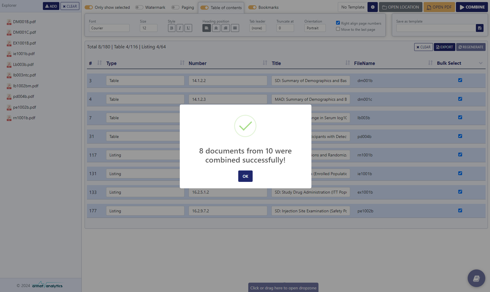

<h1 align="center">KeyCombine</h1>

<strong>Your Ultimate TLF Combining Tool</strong>

Unlock Efficiency in Clinical Reporting

<picture>
    
</picture>

# Introduction
Seamlessly merge your reporting outputs into US-eCTD compliant PDF documents with just a few clicks. Prepare for FDA submission effortlessly, ensuring precision and compliance every step of the way.

- Sumbission Ready
- US-eCTD Compliant
- Fast
- Efficient
- Simple

# Installation
Download the binary from [Releases](https://github.com/ArmatAnalytics/KeyCombine/releases) page.
